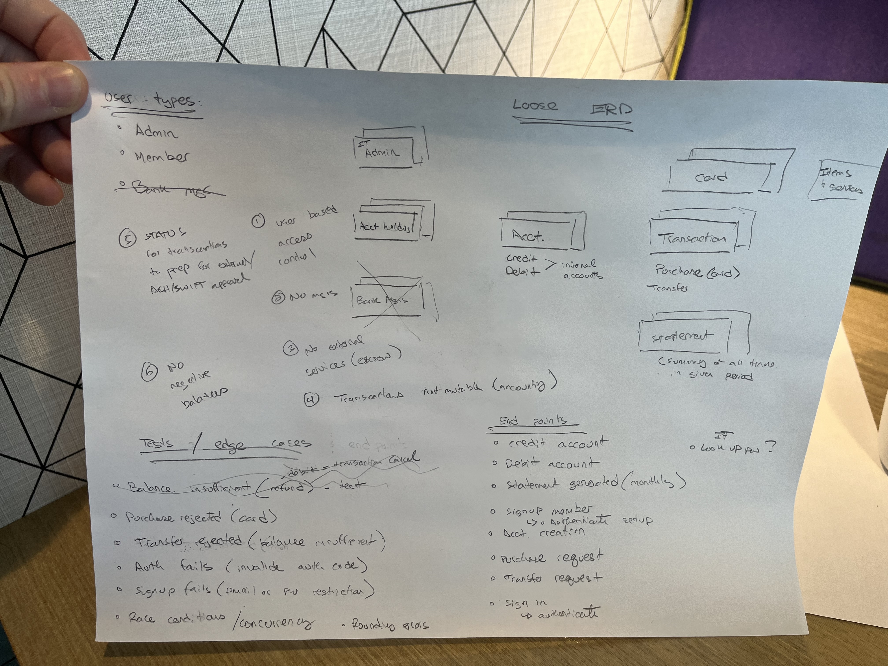
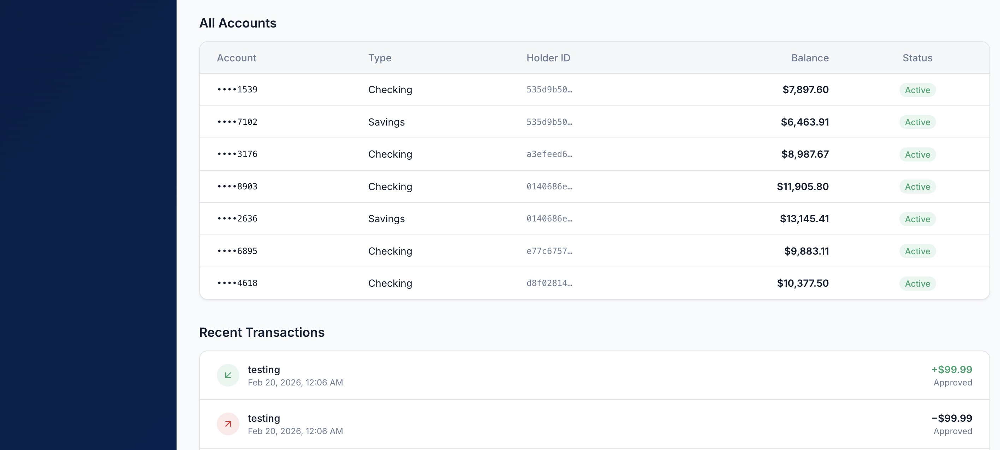

# Banking REST API

A full-stack banking application built as a take-home infrastructure exercise. FastAPI backend with SQLite, React frontend, JWT authentication, encrypted card storage, atomic transfers, and 123 automated tests.

**Live demo:** [bank-infra-exercise.vercel.app](https://bank-infra-exercise.vercel.app)

---

## Executive Summary

This project implements a banking REST API with the following capabilities:

- User registration and JWT-based authentication
- Checking and savings account management
- Credit/debit transactions with balance enforcement
- Atomic inter-account and inter-user transfers
- Encrypted debit card issuance and card-linked purchases
- Monthly statement generation with aggregates
- Role-based access control (Member and Admin)
- React frontend for all member and admin flows

### What would change in production

| Take-home constraint | Production approach |
|---|---|
| Railway (managed platform) | AWS (ECS/EKS, ALB, CloudWatch) or equivalent |
| SQLite with attached volume | PostgreSQL (RDS) with connection pooling, row-level locking |
| CORS includes localhost origins | CORS locked to production domain only |
| Demo seed script with known passwords | No seed data; user onboarding via real registration |
| Simulated card numbers / transfers | Payment processor integration (Stripe, Plaid, ACH) |
| Fernet encryption key in env var | AWS KMS / HSM for card encryption keys |
| Single-instance deployment | Horizontal scaling behind load balancer |

---

## Approach

Development used two AI tools concurrently:

- **Claude Code** (Anthropic CLI agent) for all software development: file creation, code generation, test execution, Docker configuration, and deployment. Every code change was reviewed before acceptance, both for validation and as a learning exercise.
- **ChatGPT** for business-logic and design-choice research: architectural tradeoffs, banking operations patterns, security best practices. These conversations often ran in parallel while waiting for code to render or tests to execute. Findings were brought back to Claude Code sessions as requirements and constraints.

I made most commits manually, leveraged branches for critical milestones, and reviewed every AI suggestion. The full prompt-by-prompt log is in [docs/AI_USAGE_LOG.md](docs/AI_USAGE_LOG.md).

### Early design work

Before writing code, I sketched a rough database schema to define entity relationships:



Business logic research (via ChatGPT) informed the ledger-based transfer implementation, where each transfer creates two linked transaction entries (debit + credit):



---

## Setup

### Local development

**Prerequisites:** Python 3.11+, Node.js 18+

```bash
# Clone and set up backend
git clone https://github.com/nkeeley/bank_infra_exercise.git
cd bank_infra_exercise
python3 -m venv .venv
source .venv/bin/activate
pip install -e ".[dev]"

# Configure environment
cp .env.example .env
# Generate real secrets:
python3 -c "import secrets; print(secrets.token_urlsafe(64))"        # SECRET_KEY
python3 -c "from cryptography.fernet import Fernet; print(Fernet.generate_key().decode())"  # CARD_ENCRYPTION_KEY

# Start backend
uvicorn app.main:app --reload

# In a separate terminal — set up and start frontend
cd frontend
npm install
npm run dev
```

**Run tests:**

```bash
.venv/bin/python -m pytest tests/ -v
```

### Docker

```bash
docker compose up --build
```

Backend on `http://localhost:8000`, frontend on `http://localhost:80`.

### Live deployment

The application is deployed and accessible:

- **Frontend:** [bank-infra-exercise.vercel.app](https://bank-infra-exercise.vercel.app)
- **Backend API:** [backend-production-48d37.up.railway.app](https://backend-production-48d37.up.railway.app/health)

### Demo credentials

> **Note:** These credentials are for demonstration purposes only. They were created by a seed script and use known passwords.

| Email | Password | Role | Description |
|---|---|---|---|
| `admin@bankdemo.com` | `AdminDemo123!` | Admin | Read-only view of all accounts and transactions |
| `alice.chen@example.com` | `AliceDemo123!` | Member | Checking + savings accounts, debit card, 2 months of history |
| `bob.martinez@example.com` | `BobDemo123!` | Member | Checking account with debit card |
| `carol.nguyen@example.com` | `CarolDemo123!` | Member | Checking + savings accounts |
| `dave.johnson@example.com` | `DaveDemo123!` | Member | Checking account |
| `erin.patel@example.com` | `ErinDemo123!` | Member | Checking account |

**Quick test — making a transfer:**

1. Log in as Alice Chen (`alice.chen@example.com` / `AliceDemo123!`)
2. Navigate to **Transfers**
3. Select a source account from the "From Account" dropdown
4. Select **External account (look up by number)** in the "To Account" dropdown
5. Enter Bob's account number: `2203563176` and click Search
6. Enter an amount and submit
7. Verify transfer registered by viewing the Overview tab
8. Log out and log back in via admin account (`admin@bankdemo.com` / `AdminDemo123!`)
9. Verify that transaction took place across both recipient and sender accounts

---

## Repository Overview

```
bank_infra_exercise/
├── app/                        # Backend application (FastAPI)
│   ├── main.py                 # App factory, lifespan, router registration
│   ├── config.py               # Pydantic Settings (.env loading)
│   ├── database.py             # Async SQLAlchemy engine, session, Base
│   ├── security.py             # JWT, Argon2id password hashing, Fernet encryption
│   ├── exceptions.py           # Custom exceptions + FastAPI handlers
│   ├── dependencies.py         # Auth dependencies (get_current_user, require_admin)
│   ├── models/                 # SQLAlchemy ORM models
│   │   ├── user.py             # User + UserType enum (ADMIN/EMPLOYEE/MEMBER)
│   │   ├── account_holder.py   # Banking profile (one-to-one with User)
│   │   ├── account.py          # Checking/savings accounts, CHECK >= 0
│   │   ├── transaction.py      # Credits, debits, transfer legs
│   │   └── card.py             # Encrypted debit cards (Fernet AES)
│   ├── schemas/                # Pydantic request/response schemas
│   ├── routers/                # API route handlers
│   │   ├── auth.py             # POST /auth/signup, /auth/login
│   │   ├── accounts.py         # Account CRUD + lookup
│   │   ├── transactions.py     # Create/list/get transactions
│   │   ├── transfers.py        # Atomic two-leg transfers
│   │   ├── cards.py            # Card issuance + retrieval
│   │   ├── statements.py       # Monthly statement generation
│   │   ├── account_holders.py  # Profile GET/PATCH
│   │   └── admin.py            # Read-only org-wide endpoints
│   └── services/               # Business logic layer
│       ├── auth_service.py     # Signup/login logic
│       ├── account_service.py  # Account CRUD + ownership
│       ├── transaction_service.py  # Balance enforcement, atomic transfers
│       ├── card_service.py     # Card generation + encryption
│       └── statement_service.py    # Date-range aggregation
├── tests/                      # 123 automated tests
│   ├── conftest.py             # In-memory SQLite fixtures, auth helpers
│   ├── test_auth.py            # 16 tests: signup, login, token, profile security
│   ├── test_accounts.py        # 24 tests: CRUD, ownership, RBAC, admin isolation
│   ├── test_transactions.py    # 17 tests: deposits, purchases, concurrency
│   ├── test_transfers.py       # 16 tests: atomicity, crash rollback, inter-user
│   ├── test_cards.py           # 18 tests: encryption, card-linked purchases
│   ├── test_statements.py      # 9 tests: aggregates, opening balance, ordering
│   ├── test_precision.py       # 5 tests: integer cents, no rounding errors
│   └── test_authorization.py   # 18 tests: cross-user access, admin gates
├── frontend/                   # React frontend (Vite + shadcn/ui)
│   ├── src/
│   │   ├── pages/              # Login, signup, member dashboard, admin dashboard
│   │   ├── contexts/           # AuthContext (JWT + user type management)
│   │   ├── lib/                # API client, formatting utilities
│   │   └── components/         # UI components + layouts
│   └── vercel.json             # API rewrite rules for deployment
├── demo/                       # Demo seed script + admin promotion tool
├── docs/                       # Documentation
│   ├── AI_USAGE_LOG.md         # Full prompt-by-prompt development log
│   ├── SECURITY.md             # Security considerations + OWASP coverage
│   ├── ROADMAP.md              # Future enhancements by priority
│   └── images/                 # Architecture diagrams and screenshots
├── Dockerfile.backend          # Python 3.11-slim, uvicorn
├── Dockerfile.frontend         # Node build + nginx serve
├── docker-compose.yml          # Two-service local deployment
├── nginx.conf                  # SPA fallback + API reverse proxy
├── railway.toml                # Railway deployment config
├── README.md                   # This file
├── pyproject.toml              # Python dependencies + tool config
└── .env.example                # Environment variable template
```

### Key files

| File | Purpose |
|---|---|
| `app/services/transaction_service.py` | Core business logic: balance enforcement, declined audit trail, atomic transfers with deadlock prevention (sorted UUID locking) |
| `app/security.py` | Argon2id password hashing, JWT creation/verification, Fernet card encryption |
| `app/database.py` | Async engine with `get_db()` that commits on business errors (preserving declined transactions) and rolls back on unexpected errors |
| `app/dependencies.py` | Single enforcement point for auth, ownership, and role-based access |
| `tests/conftest.py` | In-memory SQLite fixtures with isolated async clients per test |

---

## API Documentation

All monetary amounts are in **integer cents** (e.g., $50.00 = `5000`). Authentication uses JWT Bearer tokens in the `Authorization` header.

### Authentication (Public)

| Method | Path | Description |
|---|---|---|
| POST | `/auth/signup` | Register user. Body: `email`, `password` (min 8), `first_name`, `last_name`, `phone` (optional). Returns JWT token + user info. |
| POST | `/auth/login` | Authenticate. Body: `email`, `password`. Returns JWT token (30-min expiry) + `user_type`. |

### Accounts (Member)

| Method | Path | Description |
|---|---|---|
| POST | `/accounts` | Create account. Body: `account_type` ("checking" or "savings", default: "checking"). |
| GET | `/accounts` | List all accounts for authenticated user. |
| GET | `/accounts/lookup?account_number=` | Look up account by number (minimal info, for transfers). |
| GET | `/accounts/{id}` | Get account details. 403 if not owner. |
| GET | `/accounts/{id}/balance` | Get cached + computed balance with integrity check (`match` field). |

### Transactions (Member)

| Method | Path | Description |
|---|---|---|
| POST | `/accounts/{id}/transactions` | Create credit/debit. Body: `type`, `amount_cents`, `description` (optional), `card_id` (optional). Debits declined if insufficient funds (declined record preserved). |
| GET | `/accounts/{id}/transactions` | List transactions. Query filters: `status`, `type`, `limit` (1-200), `offset`. |
| GET | `/accounts/{id}/transactions/{txn_id}` | Get single transaction. |

### Transfers (Member)

| Method | Path | Description |
|---|---|---|
| POST | `/transfers` | Atomic transfer. Body: `from_account_id` (must own), `to_account_id`, `amount_cents`, `description` (optional). Creates linked debit + credit with shared `transfer_pair_id`. |

### Cards (Member)

| Method | Path | Description |
|---|---|---|
| POST | `/accounts/{id}/card` | Issue debit card (one per account). Card number + CVV encrypted at rest. |
| GET | `/accounts/{id}/card` | Get card (masked — last four digits only). |

### Profile (Member)

| Method | Path | Description |
|---|---|---|
| GET | `/account-holders/me` | Get profile (name, email, phone). |
| PATCH | `/account-holders/me` | Update profile. Body: `first_name`, `last_name`, `phone` (all optional). Email cannot be changed. |

### Statements (Member)

| Method | Path | Description |
|---|---|---|
| GET | `/accounts/{id}/statements?year=&month=` | Monthly statement: opening/closing balance, total credits/debits, transaction count, full transaction list. |

### Admin (Read-only)

| Method | Path | Description |
|---|---|---|
| GET | `/admin/accounts` | List all accounts org-wide. |
| GET | `/admin/accounts/{id}` | Get any account's details. |
| GET | `/admin/accounts/{id}/balance` | Get any account's balance. |
| GET | `/admin/transactions` | List all transactions org-wide. Supports `status`, `type`, `limit`, `offset`. |
| GET | `/admin/transactions/{txn_id}` | Get any transaction by ID. |
| GET | `/admin/accounts/{id}/transactions` | List any account's transactions. |

### Health Check

| Method | Path | Description |
|---|---|---|
| GET | `/health` | Returns `{"status": "ok", "version": "0.1.0"}`. No auth required. |
